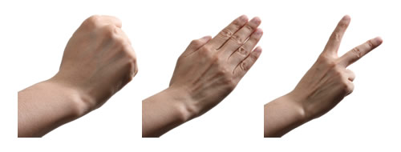
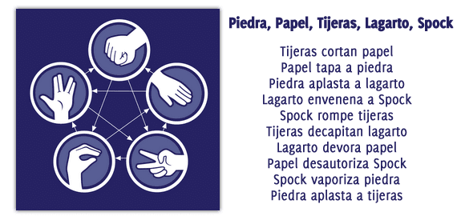

# Proyecto _PPTLS_

## Introducción:

Piedra-papel-tijeras es un juego que se juega entre dos personas con las manos. Los jugadores
cuentan hasta tres al unísono y simultáneamente hacen una de las tres señales con las manos que
corresponden a piedra, papel o tijera.



El ganador se determina por unas normas sencillas :
* Piedra rompe tijeras (el jugador de la piedra gana)
* Tijeras cortan papel (el jugador de la tijeras gana)
* Papel cubre a la piedra (el jugador del papel gana)
* Si los dos jugadores hacen la misma jugada, se considera empate.

Los jugadores suelen hacer hacer un número de rondas previamente pactado, y gana el jugador
que más rondas ha ganado.

Piedra-papel-tijeras es un juego sorprendentemente popular que mucha gente juega en serio.
Debido al hecho de que se produce un empate aproximadamente en un tercio de los juegos,
se han desarrollado variantes que incluyen más opciones para hacer los empates más improbables.

La variante más conocida es **Piedra-papel-tijeras-lagarto-Spock** (en adelante, PPTLS). Se trata
de una ampliación del juego original, propuesta por _Sam Kass_ y _Karen Bryla_, que se hizo
popular por ser mencionada en el periódico británico _The Times_ en 2005, y luego aparecer en la
serie _The Big Bang Theory_ en 2008.

<iframe width="560" height="315" src="https://www.youtube-nocookie.com/embed/_tsy4q9ibAE"
frameborder="0" allow="accelerometer; autoplay; encrypted-media; gyroscope; picture-in-picture" allowfullscreen></iframe>

Cada elección gana contra otras dos opciones, pierde frente a otras dos opciones y 
empata contra la misma opción.



En este mini-proyecto, vamos a construir una aplicación de consola que disputará un juego de
tres rondas contra el usuario humano, generando sus propias elecciones al azar.

El juego pedirá una palabra al usuario, con el mensaje *Tu jugada:*  (con un espacio al final) y se asegurará de que es una de éstas:
*piedra*, *papel*, *tijeras*, *lagarto* o *Spock* con esa misma grafía de mayúsculas y minúsculas. Si la palabra que introduce el usuario no es una de esas, el programa lo indicará con el mensaje *incorrecto* por el terminal y volverá a pedir la jugada

El ordenador escogerá una jugada al azar, y la indicará por el terminal con el mensaje Ordenador saca XXX y determinará quién ha ganado esa ronda, emitiendo uno de estos mensajes:

* gana ordenador
* gana jugador
* empate

Se anota un punto al ganador, y si hay empate no se anotan puntos. Al final de las tres rondas se imprimen los puntos acumulados con el siguiente mensaje: **Jugador: XX; Ordenador: XX;**

## Ejemplo
<iframe class="m-auto d-block" src="https://trinket.io/embed/python/0795f44938?outputOnly=true&runOption=run" style="width:100%; height:400px; max-width:400px" frameborder="0" marginwidth="0" marginheight="0" allowfullscreen></iframe>

## La lógica del juego:

Para determinar quién gana una ronda, PPTLS tiene un conjunto de diez reglas, como puedes ver en el diagrama de arriba. Tanto la jugada del ordenador como la del usuario se escogen de entre cinco posibilidades, lo que hace que haya 25 combinaciones sobre las que aplicar esas 10 reglas (10 en el sentido jugador-ordenador, otras 10 en sentido contrario y 5 combinaciones de empate)
Hacer una explosión combinatoria requería un if/else/if de 25 ramas. Se puede simplicar facilmente a 21 porque todos los empates se pueden comprobar con una sola condición de igualdad.

No obstante, **se puede evitar**: existe una solución ingeniosa para determinar el ganador de una jugada de forma sencilla, con muchas menos comprobaciones. Si se asignan códigos numéricos a cada una de las cinco opciones de esta manera:

0 - piedra  
1 - Spock  
2 - papel  
3 - lagarto  
4 - tijeras  

Aplicando aritmética modular cada opción gana a las dos anteriores, y pierde frente a las dos posteriores.

* papel gana a spock y piedra, y pierde frente a lagarto y tijeras.
* lagarto gana a papel y a Spock, y pierde frente a tijeras y (dando la vuelta) piedrafff.
* etc.

> Si restas una jugada de otra en módulo 5, y el resultado es 1 o 2, entonces el jugador de la primera jugada gana, 
> si es un 0 empata, y en otro caso pierde.

Recuerda que en una resta nos podemos ir a negativos: hay que añadir un 5, como hiciste en el ejercicio de restar horas.

## La codificación
Crearemos una clase llamada `Main`, en un paquete `pptls`, con los siguientes miembros:

* `int puntosJugador;` variable de instancia que representa a los puntos del jugador. Al ser de instancia será accesible por los cuatro métodos de instancia que vamos a programar
* `int puntosOrdenador;` ídem para los puntos del ordenador
* `Scanner in;` El Scanner para leer del teclado. Como nuestro programa va a ejecutar varios métodos, debemos tener el Scanner accesible en todo momento, así que lo declaramos de instancia, y lo inicializaremos al principio de la ejecución.
* `public String convertirNombreANumero(String nombre)` acepta una de las cinco jugadas y devuelve el código numérico asignado, o un -1 si la cadena nombre no corresponde a ninguna de las jugadas
* `public String convertirNumeroANombre(int numero)` acepta un número entre 0 y 4, y devuelve el nombre asociado a la jugada, o la cadena vacía "" si el numero no está en ese rango.
*`public void ronda()` hace una ronda completa, según lo descrito arriba, comenzando por pedir la jugada al usuario y terminando por decir quién gana la ronda
* `public void run()` Inicializa la variable de instancia in a un nuevo objeto Scanner asociado a la entrda estándar System.in, y también las dos variables de instancia de los puntos a 0. Invoca tres veces el método jugada() y finalmente imprime el mensaje de los puntos.
* `public static void main(String[] args)` : Como de costumbre, solo un bootstrapping: crea una instancia de la clase de la aplicación e invoca a run();

### Notas adicionales

#### Números aleatorios
Hay varias formas de generar números aleatorios en java. Una de las más básicas consiste en utilizar el método `Math.random()` que genera un double aleatorio entre 0 (incluído) y 1 (excluído). La siguiente expresión genera un número entre 0 y 5 (excluído). Asegúrate de comprender por qué.  
```java
(int) (Math.ramdom() * 5)
```

#### Comparar cadenas
Si necesitases comparar cadenas, ten en cuenta que el operador de comparación `==` sólo se aplica a tipos primitivos. La equivalencia de objetos en Java se realiza de manera general con el método `equals(…)`, que todos los objetos comparables de java tienen. Por ejemplo, si quiero saber si la variable de tipo cadena s contiene la cadena "Hola", se utiliza una expresión como `s.equals("Hola")`, que devolverá true si, en efecto, el contenido referenciado por la variable s equivale a "Hola", y false en caso contrario. La expresión `"Hola".equals(s)` es igualmente correcta y tendría un comportamiento similar.

## La entrega
En este ejercicio me gustaría que nos fijásemos no solo en que el algoritmo funcione, sino en la exactitud y pulcritud, así que vamos a tener especialmente en cuenta algunas cosas.

* Presta atención a utilizar de manera exacta los identificadores, literales y signaturas que se proporcionan. (clase, paquete, variables, métodos, y mensajes en el terminal).
* Sigue las normas de estilo: una indentación de 4 espacios, llaves estilo K&R variante Java, 100 caracteres por línea y el resto que ya sabemos... Recuerda que las tenemos resumidas en la página del módulo.
* Documenta la clase y cada método con comentarios de javadoc. Redacta los comentarios pensando en que sean útiles para quien vaya a mantener, revisar o utilizar tu código.

